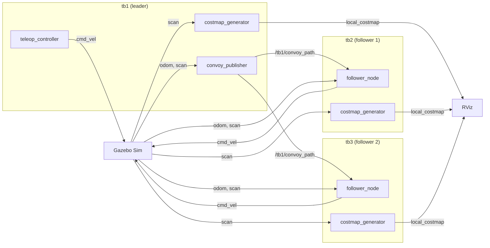
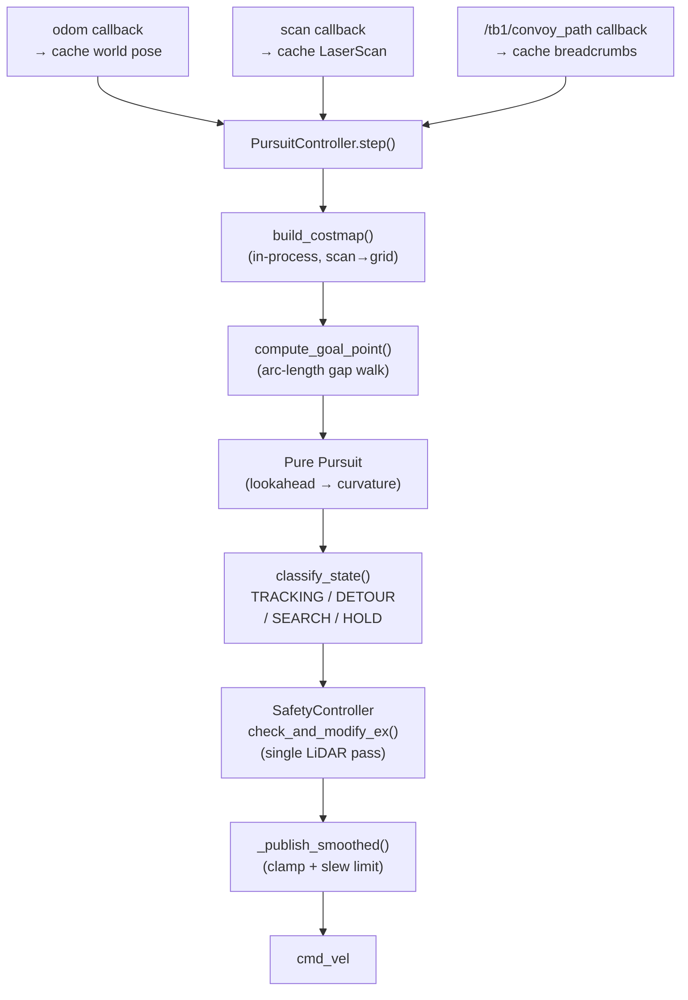

<div align="center">

# 🤖 Multi-TurtleBot3 Convoy System

*ROS 2 Jazzy · Gazebo Sim Harmonic · TurtleBot3 Burger*


> **University Assignment** — Hochschule Darmstadt · Prof. Dr.-Ing. Karl Kleinmann

</div>

---

## Overview

3-robot TurtleBot3 Burger convoy in Gazebo Sim. `tb1` is teleoperated; `tb2` and `tb3` follow using **Pure Pursuit** on a shared `nav_msgs/Path`. LiDAR is used for emergency stop and local costmap-based obstacle avoidance.

---

## Architecture

### Node Graph



### Control Pipeline (per follower, every 20 Hz tick)



### Module Layers

```mermaid
graph BT
  subgraph Pure Python — no ROS
    CU[costmap_utils.py]
    CT[convoy_tracking.py]
    FS[follower_state.py]
    SC[safety_controller.py]
    MC[motion_controller.py]
  end

  subgraph ROS Nodes
    FN[follower_node.py]
    CPB[convoy_publisher.py]
    CGN[costmap_generator.py]
    TEL2[teleop_controller.py]
  end

  subgraph Python Package
    LC[launch_common.py]
    SDF[generate_sdf.py]
    LP["perception/laser_processor.py\n(future use)"]
  end

  MC --> FN
  CU --> MC
  CT --> MC
  FS --> MC
  SC --> MC
  CU --> CGN
```

---


## Prerequisites

```bash
sudo apt install -y \
  ros-jazzy-turtlebot3 ros-jazzy-turtlebot3-gazebo \
  ros-jazzy-ros-gz ros-jazzy-ros-gz-bridge ros-jazzy-rviz2 \
  ros-jazzy-slam-toolbox ros-jazzy-nav2-map-server
```

Add to `~/.bashrc`:
```bash
source /opt/ros/jazzy/setup.bash
source ~/ros2_ws/install/setup.bash
export TURTLEBOT3_MODEL=burger
```

---

## Build

```bash
colcon build --packages-select multi_tb3_system
source install/setup.bash
```

---

## Quick Start

```bash
# Launch simulation
ros2 launch multi_tb3_system robot.launch.py world:=pillars ros_ui:=true

# In a second terminal — drive the leader
ros2 run multi_tb3_system teleop_controller.py --ros-args -r __ns:=/tb1
```

Hold a key to move, release to stop. Followers start automatically.

---

## Launch Arguments

| Argument | Default | Description |
|---|:---:|---|
| `world` | `empty` | `empty`, `pillars`, `office` |
| `nBurger` | `2` | Follower count (1–2) |
| `convoy_spacing` | `0.5` | Gap per slot in metres |
| `ros_ui` | `false` | `true` = RViz + Gazebo GUI + costmap viz |
| `gz` | `false` | Gazebo GUI only |
| `rviz` | `false` | RViz + costmap viz only |
| `use_sim_time` | `true` | Sim clock or wall clock |
| `enable_mapping` | `false` | Start slam_toolbox |
| `slam_robot` | `tb1` | `tb1`, `tb2`, `tb3`, `all` |

---

## Project Structure

```
multi_tb3_system/
├── scripts/                        # ROS executable nodes + pure-logic helpers
│   ├── convoy_publisher.py         # Publishes leader breadcrumb path (10 Hz)
│   ├── convoy_tracking.py          # Pure: goal-point walk, breadcrumb freshness
│   ├── costmap_generator.py        # Viz-only costmap node (gated: enable_costmap_viz)
│   ├── costmap_utils.py            # Pure: scan → occupancy grid, obstacle queries
│   ├── follower_node.py            # ROS shell: params, subs, pub, thin control loop
│   ├── follower_state.py           # Pure: state machine classify + command builders
│   ├── motion_controller.py        # Pure: Pure Pursuit + safety override (testable)
│   ├── safety_controller.py        # Pure: emergency stop / steering bias
│   └── teleop_controller.py        # Burst-mode keyboard teleop
├── multi_tb3_system/               # Importable Python package
│   ├── launch_common.py            # Convoy geometry constants (single source of truth)
│   ├── generate_sdf.py             # Per-robot SDF generator
│   └── perception/
│       └── laser_processor.py      # Scan clustering library (future use)
├── launch/
│   ├── robot.launch.py             # ⭐ Entry point
│   ├── followers.launch.py         # Starts convoy_publisher + costmap + followers
│   ├── spawn_robots.launch.py
│   ├── gazebo.launch.py / worlds.launch.py
│   ├── mapping.launch.py
│   └── rviz.launch.py
├── config/
│   ├── follower_params.yaml        # All tunable parameters (single source of truth)
│   └── mapping_online_async.yaml
├── worlds/
│   ├── empty.world
│   └── pillars.world
└── models/turtlebot3_burger/
```

---

## SLAM Mapping

```bash
# Launch with mapping
ros2 launch multi_tb3_system robot.launch.py enable_mapping:=true ros_ui:=true

# Save the map
ros2 run nav2_map_server map_saver_cli -f ~/maps/my_map
```
